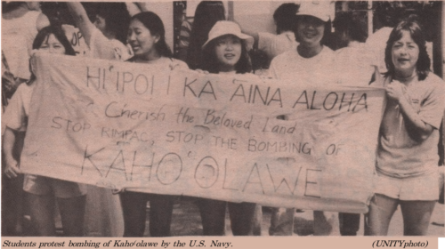

As part of my introductory philosophy course, I wrote a short analysis of George Helm's Personal Statement found in his personal journal. 

George Helm was a Hawaiian activist and musician who advocated for the halt of military bombing exercises on the Hawaiian island of Kahoolawe.

In the analysis, I examined how Helm wrote his call-to-action. I described the imagery and structure of his arguments, as well as the rhetorical/persuasive techniques used to invoke a response from the reader. A project such as this allows me to discern and identify implementations of formal logic and deductive reasoning.

Snippet below:
```
George Helm’s central argument goes as follows:
  Premise #1: The ‘aina is sacred and needs to be cared for.
  Premise #2: I must protect the ‘aina.
  Premise #3: The US military is destroying the ‘aina.
  Conclusion: Thus, it is my duty to put an end to the military’s treatment of the ‘aina.
```
