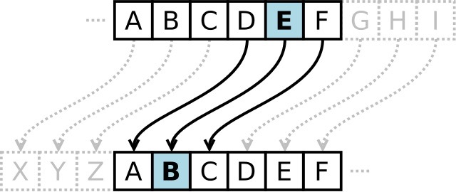

<p align="center">
  
</p>

This program implements a monoalphabetical substitution cipher. In this cipher, each letter of plaintext is swapped by another letter determined via a 26-character key. The key must contain unique letters--each one corresponding to a letter in the alphabet. The program preserves letter case and punctuation.

The user inputs a key as a command-line argument, followed by some original message to be encrypted with that key. The translated message will be displayed as ciphertext. This project helped me learn the basics of cryptography, string manipulation, and error handling.

```
$ ./program ZEBRASCDFGHIJKLMNOPQTUVWXY
plaintext:  Flee at once. We are discovered!
ciphertext: Siaa zq lkba. Va zoa rfpbluaoar!
```
[Source code](https://github.com/jamesgphan/subcipher)
